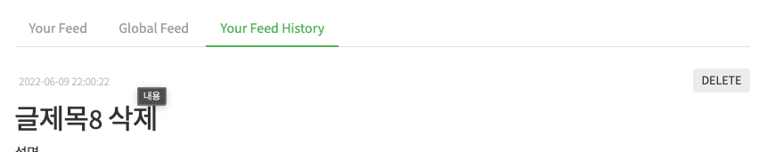
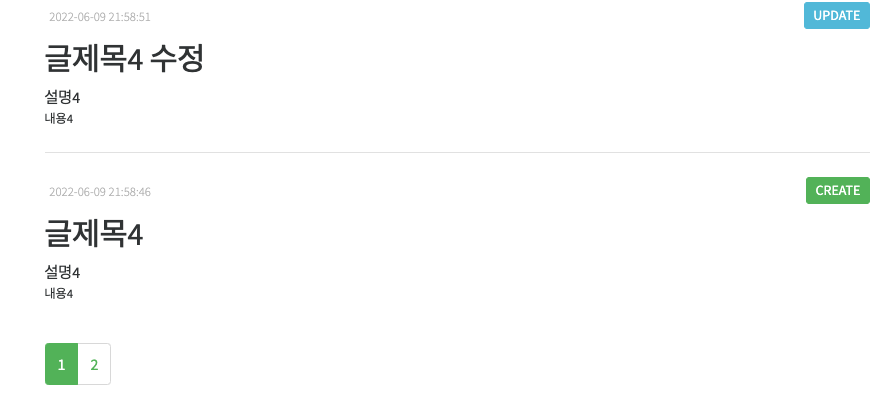
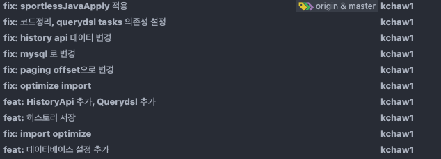

# 구현 내용

## 화면

- 로그인시 Your Feed history 탭이 생성되고 작성했던 글이 최신순으로 정렬되어 글의 상태(CREATE,UPDATE,DELETE)와 함께 표출됩니다.

- 하단부에 페이징 구현

## 구현 방법
- 기존 sqlite 는 Mybatis 전용 DB로, JPA는 h2로 구성하였으며 각각 MybatisConfig, JpaConfig 에 DB연결에 대한 설정을 작성하였습니다.
- Spring Data JPA와 Querydsl 을 사용하여 HistoryApi를 구현하였습니다.
- 게시글 작성, 수정, 삭제시 게시글의 메타정보를 History 엔티티로 변환하여 HistoryRepository를 통해 데이터베이스에 저장합니다.
- 기존 프로젝트에서 사용하던 @AuthenticationPrincipal 애노테이션을 통해 현재 로그인한 유저의 정보를 얻고 
  로그인한 userId를 통해 본인의 게시물만 확인 할 수 있도록 하였습니다.

## 형상관리

- 개발내용에 따른 컨벤션에 맞춰 형상관리를 하였습니다.

## 실행방법
- realworld 디렉토리에서 docker-compose up 명령어로 어플리케이션을 실행
- http://localhost:3000 으로 접속합니다.